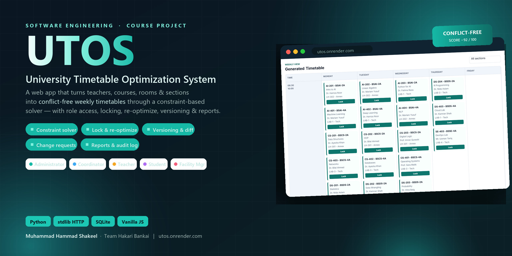

<p align="center">
  
</p>

<h1 align="center">UTOS — University Timetable Optimization System</h1>

<p align="center">
  Conflict-free weekly timetables for academic departments — a constraint-based
  solver with role-based access, locking, re-optimization, versioning &amp; live reports.
</p>

<p align="center">
  <a href="https://utos.onrender.com"></a>
  
  
  
</p>

---

A web-based timetable scheduling system for academic departments. UTOS manages
teachers, courses, rooms, sections, and timeslots; generates conflict-free
weekly timetables with a pluggable solver; and provides role-based access for
five actor types — built as a Software Engineering course project (team
"Hakari Bankai").

**Live demo:** <https://utos.onrender.com> (free tier — the first visit may take
~30s to wake the server).

---

## Features

- **Role-based dashboards** for Timetable Administrator, Department Coordinator,
  Teacher, Student, and Facility Manager — each sees only what their role allows.
- **Master data management** — full CRUD for teachers, rooms, sections, courses,
  timeslots, and holidays, plus a per-teacher availability grid.
- **Constraint-based generation** — hard constraints (no teacher/room/section
  double-booking, room capacity, room type, holidays, teacher load) and weighted
  soft preferences (morning classes, early endings, room proximity, energy
  saving, traffic reduction).
- **Manual editing & locking** — lock entries so re-optimization preserves them.
- **Re-optimization (repair)** — apply approved changes while minimizing
  disruption and keeping locked entries fixed; reports a disruption summary.
- **Change-request workflow** — teachers/coordinators submit requests; admins
  approve/reject and re-generate from an approval in one click.
- **Versioning & comparison** — every generation/repair is a saved version;
  diff any two side-by-side.
- **Publishing & notifications** — publish one official version per term;
  affected users get in-app notifications.
- **Reports** — room utilization (with peak/free flags), teacher load vs. limit,
  and section gap analysis.
- **Audit log** — every state-changing action records actor, time, and changes.
- **Export & print** — CSV export and a print stylesheet.

## Architecture

```
Frontend (vanilla HTML/CSS/JS)   →  no framework, no build step
Backend  (Python http.server)    →  ThreadingHTTPServer, JSON REST, stdlib only
Repositories & Services          →  data access + business logic
Database (SQLite)                →  master data + versioned timetables
```

The backend uses **only the Python standard library** (`http.server`, `sqlite3`,
`json`) — no third-party runtime dependencies. The solver is isolated behind a
`solve(problem) -> result` interface so it can later be swapped for an OR-Tools
CP-SAT implementation without touching the rest of the system.

## Quick start

```bash
python -m app.backend.server
# open http://127.0.0.1:8000
```

Set a different port with `UTOS_PORT=9000`. The SQLite database is created and
seeded automatically on first run at `app/data/utos.sqlite`.

### Load a realistic demo dataset (optional)

With the server running, populate a full Faculty of Computing (14 teachers,
14 rooms, 8 sections, 32 courses) that generates a conflict-free timetable:

```bash
python tools/university_seed.py
```

## Running the tests

```bash
python -B -m unittest discover -v        # full suite
python run_tests.py solver               # one category (see run_tests.py)
python -m unittest tests.test_solver -v  # one file
```

The suite covers the solver, the HTTP API, role enforcement, validation,
publishing/re-optimization, version comparison, notifications, and the
adversarial edge cases. Additional ad-hoc checks live in `tools/`
(`redteam.py`, `smoke_api.py`, `stress_seed.py`).

## Deployment

UTOS is a persistent server + on-disk SQLite app, so it needs a host that runs a
long-lived process (Render, Railway, Fly.io, a VPS) — **not** a serverless
platform like Vercel. A Render blueprint (`render.yaml`) and a `Procfile` are
included. See **[DEPLOY.md](DEPLOY.md)** for step-by-step instructions.

## Project structure

```
app/
  backend/
    algorithms/   solver (timetable_solver.py)
    repositories/ master_data, timetable, system (notifications/audit)
    services/     bootstrap + timetable orchestration
    server.py     HTTP handler & routing
    database.py   SQLite connection, schema, seed, migrations
    schema.sql    table definitions
  frontend/
    index.html    single-page shell
    scripts/      api, state, main, render (vanilla modules)
    styles/       base, layout, components, login
tests/            unit + integration + robustness + SRS-feature tests
tools/            seed/redteam/smoke scripts and doc generators
docs/             SRS, use cases, domain model, DFDs, class diagram, SSDs
```

## Software engineering artifacts

This is a course project, so `docs/` also contains the analysis & design
deliverables: the SRS, use-case analysis (UC00–UC22), domain model, data-flow
diagrams, class diagram, system sequence diagrams, and operation contracts.

## License

See [LICENSE](LICENSE).
