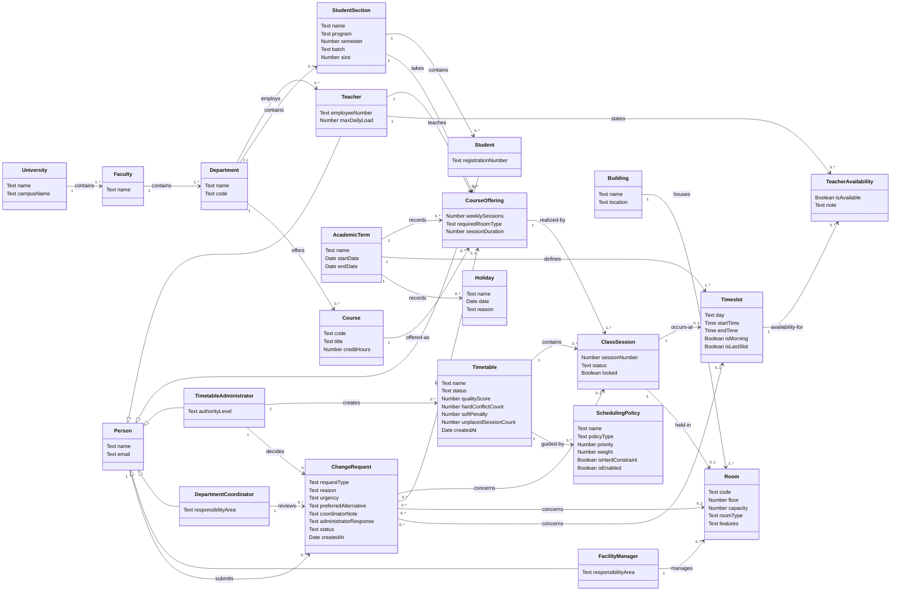

# Domain Model

Project: University Timetable Optimization and Management System (UTOS)

Scope: Core class timetable domain. Optional exam concepts are listed separately because the current implementation and assignment focus on class timetabling.

## 1. Modeling Rules Applied From the Lecture Slides

This model follows the lecture guidance:

- Model real-world domain concepts, not software artifacts.
- Prefer concepts, attributes, and associations over function/process decomposition.
- Do not include windows, screens, databases, APIs, methods, or solver internals as domain concepts.
- Do not use foreign-key style attributes such as `teacherId`, `roomId`, or `sectionId`; use associations instead.
- If a value is really a complex real-world thing, model it as a separate concept.
- Keep attributes simple and meaningful to the real-world concept.
- Add associations only when the relationship needs to be remembered by the system.
- Show multiplicity on each association.

## 2. Candidate Concepts From Category List

| Lecture Concept Category | UTOS Candidate Concepts |
| --- | --- |
| Physical or tangible objects | Room, Building |
| Specifications or descriptions | Course, CourseOffering, SchedulingPolicy |
| Places | Department, Faculty, University, Building |
| Transactions or records | Timetable, ChangeRequest |
| Transaction line items | ClassSession |
| Roles of people | Teacher, Student, TimetableAdministrator, DepartmentCoordinator, FacilityManager |
| Containers of other things | University, Faculty, Department, StudentSection, Timetable |
| Things in a container | Student, Teacher, Course, Room, ClassSession |
| Rules and policies | SchedulingPolicy, TeacherAvailability, Holiday |
| Records of work | Timetable, ChangeRequest, RoomUsageReport |

## 3. Concepts Excluded From the Domain Model

These are important for implementation, but they are not real-world domain concepts:

- Database
- SQLite table
- API endpoint
- HTTP route
- Browser screen
- Login session
- LocalStorage
- SolverRun
- Algorithm class
- CRUD form
- Render function
- Foreign key attributes such as `teacher_id`, `room_id`, `timeslot_id`

`RoomUsageReport` is derived from timetable and room data. It can be mentioned as an output for the FacilityManager, but it is not part of the core domain model unless the instructor requires report objects.

## 4. Final Concepts and Attributes

### University
- name
- campusName

### Faculty
- name

### Department
- name
- code

### Person
- name
- email

### Teacher
- employeeNumber
- maxDailyLoad

### Student
- registrationNumber

### TimetableAdministrator
- authorityLevel

### DepartmentCoordinator
- responsibilityArea

### FacilityManager
- responsibilityArea

### StudentSection
- name
- program
- semester
- batch
- size

### AcademicTerm
- name
- startDate
- endDate

### Course
- code
- title
- creditHours

### CourseOffering
- weeklySessions
- requiredRoomType
- sessionDuration

Rationale: `Course` is the description of a subject. `CourseOffering` is the real scheduled offering of that course for one section, teacher, and term.

### Building
- name
- location

### Room
- code
- floor
- capacity
- roomType
- features

### Timeslot
- day
- startTime
- endTime
- isMorning
- isLastSlot

### Holiday
- name
- date
- reason

### TeacherAvailability
- isAvailable
- note

### SchedulingPolicy
- name
- policyType
- priority
- weight
- isHardConstraint
- isEnabled

Examples: no teacher clash, no room clash, section clash prevention, room capacity, teacher availability, holiday avoidance, morning preference, early ending preference, room proximity, energy saving.

### Timetable
- name
- status
- qualityScore
- hardConflictCount
- softPenalty
- unplacedSessionCount
- createdAt

### ClassSession
- sessionNumber
- status
- locked

Rationale: `ClassSession` is a logical line item of a timetable. It represents one scheduled meeting of a course offering.

### ChangeRequest
- requestType
- reason
- urgency
- preferredAlternative
- coordinatorNote
- administratorResponse
- status
- createdAt

### RoomUsageReport
- reportDate
- utilizationSummary
- conflictSummary

Rationale: derived report concept; include only if the assignment requires reports in the model.

## 5. Main Associations With Multiplicity

- One `University` contains one or more `Faculty` objects. `1 to 1..*`
- One `Faculty` contains one or more `Department` objects. `1 to 1..*`
- One `Department` employs zero or more `Teacher` objects. `1 to 0..*`
- One `Department` contains zero or more `StudentSection` objects. `1 to 0..*`
- One `Department` offers zero or more `Course` objects. `1 to 0..*`
- One `StudentSection` contains zero or more `Student` objects. `1 to 0..*`
- One `AcademicTerm` records zero or more `CourseOffering` objects. `1 to 0..*`
- One `Course` is offered as zero or more `CourseOffering` objects. `1 to 0..*`
- One `Teacher` teaches zero or more `CourseOffering` objects. `1 to 0..*`
- One `StudentSection` takes zero or more `CourseOffering` objects. `1 to 0..*`
- One `Building` houses one or more `Room` objects. `1 to 1..*`
- One `AcademicTerm` defines one or more `Timeslot` objects. `1 to 1..*`
- One `AcademicTerm` records zero or more `Holiday` objects. `1 to 0..*`
- One `Teacher` states zero or more `TeacherAvailability` records. `1 to 0..*`
- One `TeacherAvailability` refers to one `Timeslot`. `1 to 1`
- One `Timetable` contains zero or more `ClassSession` objects. `1 to 0..*`
- One `CourseOffering` is realized by one or more `ClassSession` objects. `1 to 1..*`
- One `ClassSession` occurs in zero or one `Timeslot`. `1 to 0..1`
- One `ClassSession` is held in zero or one `Room`. `1 to 0..1`
- One `Timetable` is guided by zero or more `SchedulingPolicy` objects. `1 to 0..*`
- One `Person` may submit zero or more `ChangeRequest` objects. `1 to 0..*`
- One `DepartmentCoordinator` reviews zero or more `ChangeRequest` objects. `1 to 0..*`
- One `TimetableAdministrator` creates zero or more `Timetable` objects. `1 to 0..*`
- One `TimetableAdministrator` approves or rejects zero or more `ChangeRequest` objects. `1 to 0..*`
- One `FacilityManager` manages zero or more `Room` objects. `1 to 0..*`
- One `ChangeRequest` concerns zero or one `ClassSession`, `CourseOffering`, `Room`, or `Timeslot`. `1 to 0..1 target`

## 6. UML Domain Model



## 7. Text-Based Model

```text
University
- name
- campusName

Faculty
- name

Department
- name
- code

Person
- name
- email

Teacher
- employeeNumber
- maxDailyLoad

Student
- registrationNumber

StudentSection
- name
- program
- semester
- batch
- size

AcademicTerm
- name
- startDate
- endDate

Course
- code
- title
- creditHours

CourseOffering
- weeklySessions
- requiredRoomType
- sessionDuration

Building
- name
- location

Room
- code
- floor
- capacity
- roomType
- features

Timeslot
- day
- startTime
- endTime
- isMorning
- isLastSlot

Holiday
- name
- date
- reason

TeacherAvailability
- isAvailable
- note

SchedulingPolicy
- name
- policyType
- priority
- weight
- isHardConstraint
- isEnabled

Timetable
- name
- status
- qualityScore
- hardConflictCount
- softPenalty
- unplacedSessionCount
- createdAt

ClassSession
- sessionNumber
- status
- locked

ChangeRequest
- requestType
- reason
- urgency
- preferredAlternative
- coordinatorNote
- administratorResponse
- status
- createdAt

Relationships:
- University contains Faculty.
- Faculty contains Department.
- Department employs Teacher.
- Department contains StudentSection.
- Department offers Course.
- StudentSection contains Student.
- AcademicTerm records CourseOffering.
- Course is offered as CourseOffering.
- Teacher teaches CourseOffering.
- StudentSection takes CourseOffering.
- Building houses Room.
- AcademicTerm defines Timeslot.
- AcademicTerm records Holiday.
- Teacher states TeacherAvailability for Timeslot.
- Timetable contains ClassSession.
- CourseOffering is realized by ClassSession.
- ClassSession occurs at Timeslot.
- ClassSession is held in Room.
- Timetable is guided by SchedulingPolicy.
- Person submits ChangeRequest.
- Coordinator reviews ChangeRequest.
- Administrator creates Timetable and decides ChangeRequest.
- FacilityManager manages Room.
- ChangeRequest concerns ClassSession, CourseOffering, Room, or Timeslot.
```

## 8. Optional Exam Timetable Extension

Only add these if the project scope includes exam scheduling:

### Exam
- examType
- duration
- status

### ExamSession
- date
- startTime
- endTime

### InvigilationAssignment
- dutyRole
- status

### BuildingDistance
- distanceValue

Exam associations:

- One `Course` may have zero or more `Exam` objects.
- One `Exam` is scheduled into zero or one `ExamSession`.
- One `ExamSession` is held in one or more `Room` objects.
- One `Teacher` receives zero or more `InvigilationAssignment` objects.
- One `BuildingDistance` relates two `Building` objects.

## 9. Short Explanation

The domain model represents the real-world timetable domain of UTOS. The university contains faculties and departments. Departments offer courses, employ teachers, and contain student sections. A course is separated from a course offering because the same course description can be offered in different terms, sections, or teachers.

The timetable is made from class sessions. Each class session realizes one course offering and may be placed in a room and timeslot. Teacher availability, holidays, and scheduling policies guide whether a timetable is valid and how good it is.

The actor roles are modeled as people in the domain: teachers, students, administrators, coordinators, and facility managers. People submit change requests, coordinators review them, administrators decide them, and facility managers manage rooms. This keeps the model focused on real-world concepts and relationships instead of screens, databases, or code.
